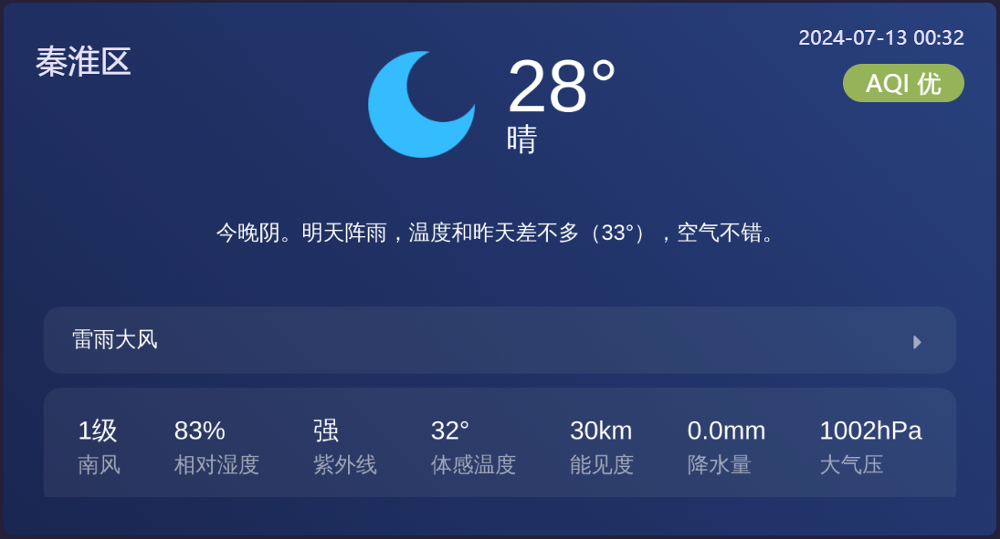
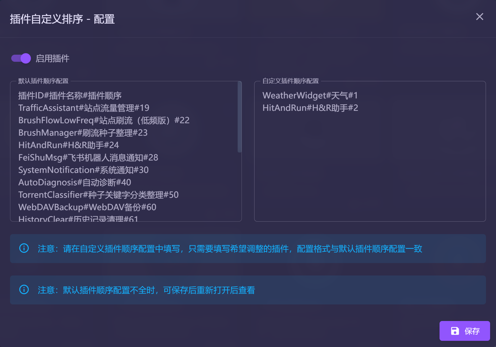
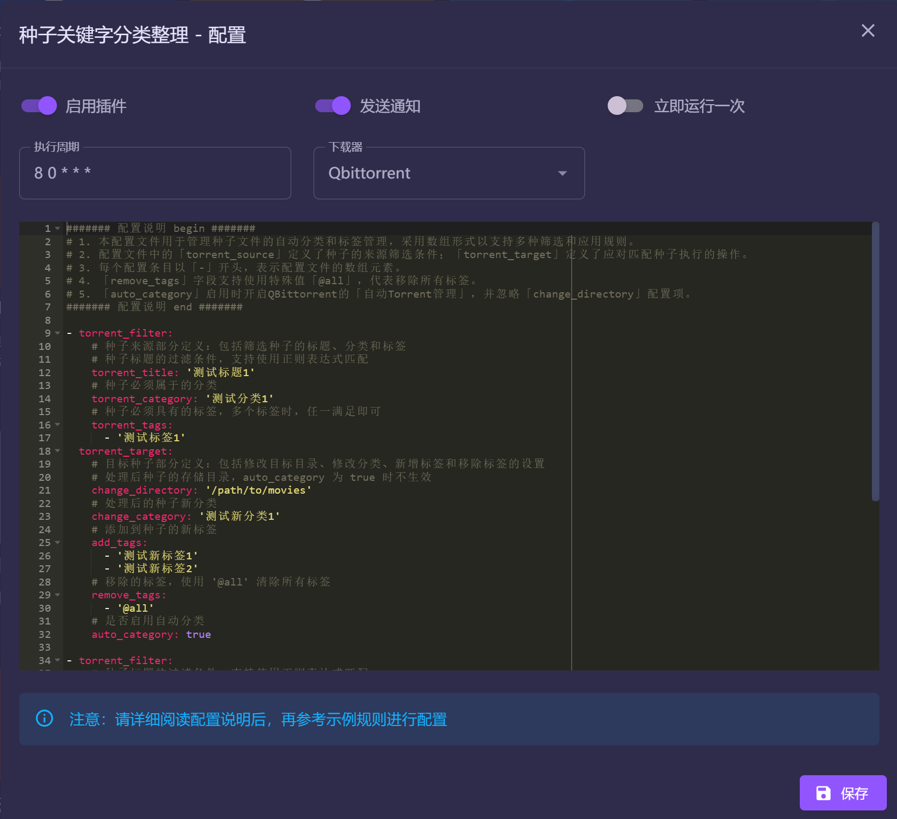
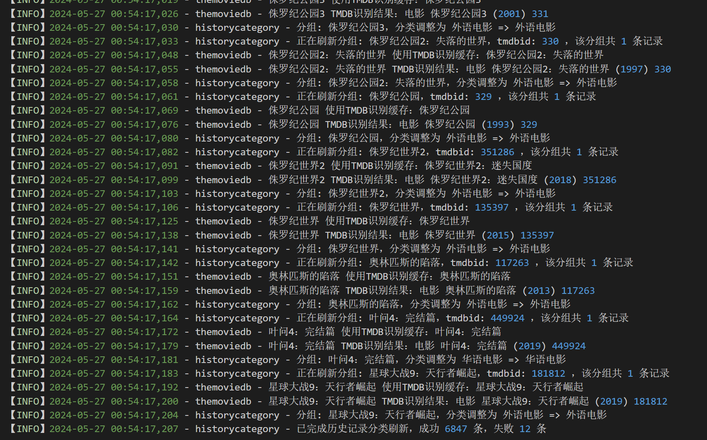
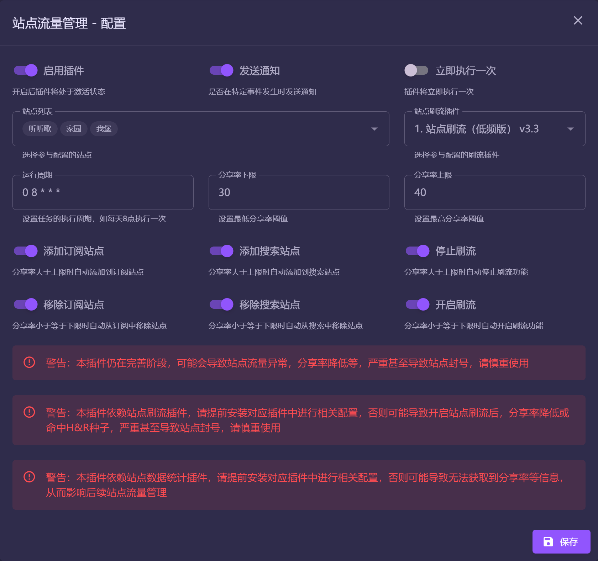
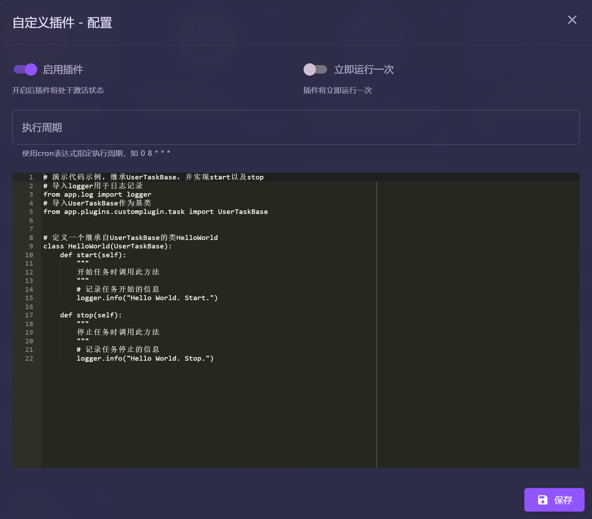
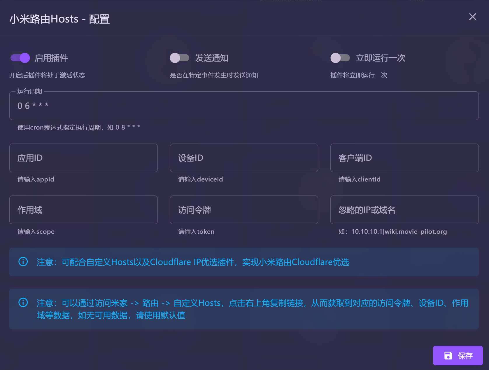
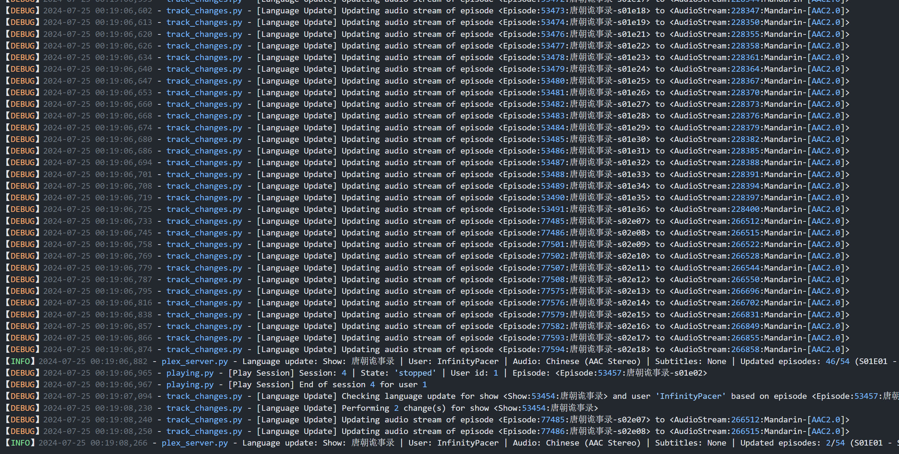
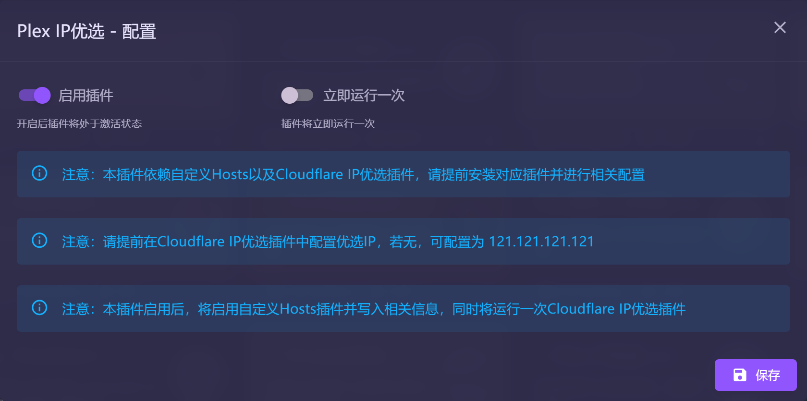
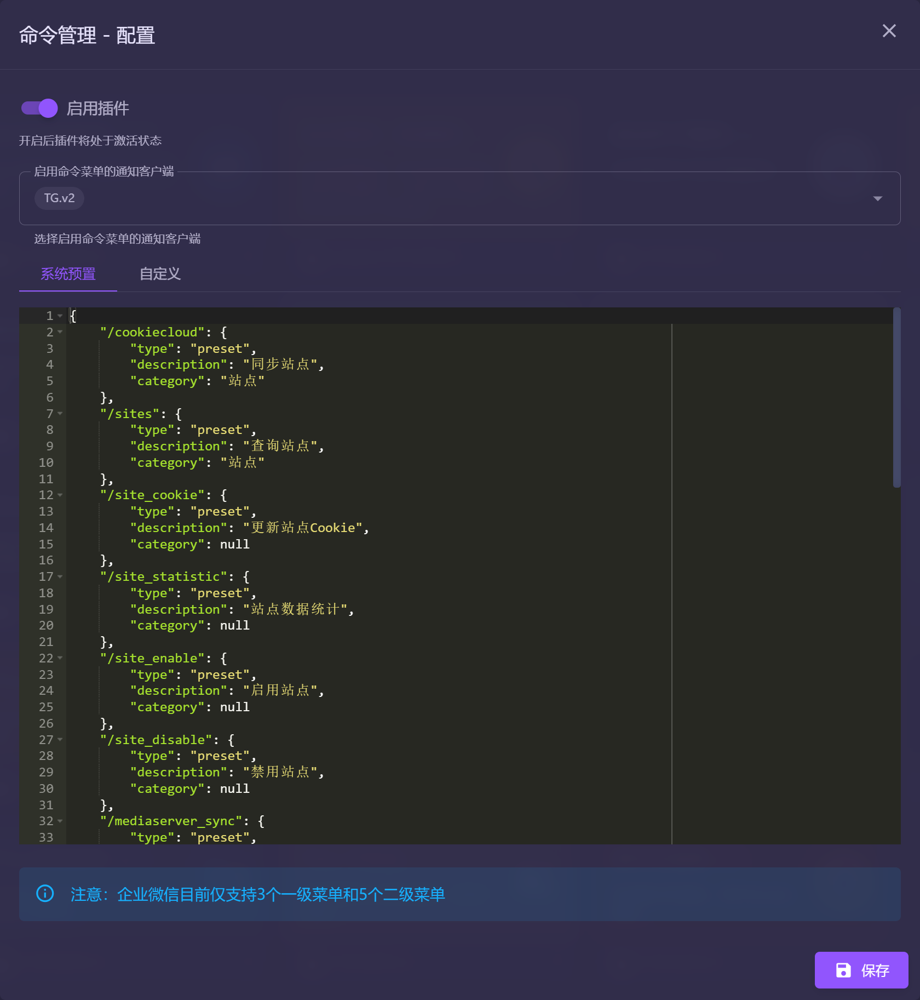

# MoviePilot-Plugins

MoviePilot三方插件：https://github.com/InfinityPacer/MoviePilot-Plugins

## 安装说明

MoviePilot环境变量添加本项目地址，具体参见 https://github.com/jxxghp/MoviePilot

## 插件集合


## 插件说明

### 1. [站点刷流（低频版）](https://github.com/InfinityPacer/MoviePilot-Plugins/blob/main/plugins.v2/brushflowlowfreq/README.md)

- 在官方刷流插件的基础上，新增了若干项功能优化了部分细节逻辑，目前已逐步PR至官方插件。在此，再次感谢 [@jxxghp](https://github.com/jxxghp) 提供那么优秀的开源作品。
- 详细配置说明以及刷流规则请参考 [README](https://github.com/InfinityPacer/MoviePilot-Plugins/blob/main/plugins/brushflowlowfreq/README.md)


### 2. 飞书机器人消息通知

- 详细使用参考飞书官方文档，[自定义机器人使用指南](https://open.feishu.cn/document/client-docs/bot-v3/add-custom-bot)


### 3. 插件热加载

- 直接在Docker中调试插件时，无需重启容器即可完成插件热加载


### 4. 刷流种子整理

- 针对刷流种子进行整理入库操作，目前仅支持QB
- 添加MP标签建议配合MP中的「监控默认下载器」选项
- 移除刷流标签建议配合刷流插件中的「下载器监控」选项
- 入库由MoviePliot的下载器监控或者目录监控完成，本插件仅提供种子操作如自动分类，添加MP标签等功能


### 5. Plex元数据刷新

- 定时通知Plex刷新最近入库元数据
- 部分电影/剧集的元数据更新滞后于其发布日期，Plex可能无法及时更新这些信息
- 通过定期触发元数据刷新操作，确保用户始终可以访问最新元数据


### 6. WebDAV备份

- 定时通过WebDAV备份数据库和配置文件。

#### 感谢

- 参考了 [thsrite/MoviePilot-Plugins](https://github.com/thsrite/MoviePilot-Plugins/) 项目，实现了插件的相关功能。
- 特此感谢 [thsrite](https://github.com/thsrite) 等贡献者的卓越代码贡献。
- 如有未能提及的作者，请告知我以便进行补充。


### 7. Plex中文本地化

- 实现拼音排序、搜索及类型标签中文本地化功能。

#### 感谢

- 本插件基于 [plex_localization_zhcn](https://github.com/sqkkyzx/plex_localization_zhcn)，[plex-localization-zh](https://github.com/x1ao4/plex-localization-zh) 项目，实现了插件的相关功能。
- 特此感谢 [timmy0209](https://github.com/timmy0209)、[sqkkyzx](https://github.com/sqkkyzx)、[x1ao4](https://github.com/x1ao4)、[anooki-c](https://github.com/anooki-c) 等贡献者的卓越代码贡献。
- 如有未能提及的作者，请告知我以便进行补充。


### 8. [PlexAutoSkip](https://github.com/InfinityPacer/PlexAutoSkip)

- 实现自动跳过Plex中片头、片尾以及类似的内容。
- 目前支持的Plex客户端，参考如下
    - Plex for iOS
    - Plex for Apple TV
- 由于Plex调整，部分客户端仅部分版本支持，仅供参考
    - Plex Web
    - Plex for Windows
    - Plex for Mac
    - Plex for Linux
    - Plex for Roku
    - Plex for Android (TV)
    - Plex for Android (Mobile)
- 相关配置请参考[说明](https://github.com/InfinityPacer/PlexAutoSkip/blob/master/README.md)以及[Wiki](https://github.com/InfinityPacer/PlexAutoSkip/wiki)

#### 感谢

- 本插件基于 [PlexAutoSkip](https://github.com/mdhiggins/PlexAutoSkip) 项目，实现了插件的相关功能。
- 特此感谢 [mdhiggins](https://github.com/mdhiggins) 的卓越代码贡献。
- 如有未能提及的作者，请告知我以便进行补充。


### 9. PlexEdition

- 根据入库记录修改Edition为电影版本/资源类型/特效信息，字段来源于[MOVIE_RENAME_FORMAT](https://github.com/jxxghp/MoviePilot?tab=readme-ov-file#2-%E7%8E%AF%E5%A2%83%E5%8F%98%E9%87%8F--%E9%85%8D%E7%BD%AE%E6%96%87%E4%BB%B6)中的**edition**版本（资源类型+特效）

#### 感谢

- 灵感来自于项目 [plex-edition-manager](https://github.com/x1ao4/plex-edition-manager) ，特此感谢 [x1ao4](https://github.com/x1ao4)。
- 如有未能提及的作者，请告知我以便进行补充。


### 10. 历史记录清理

- 清理历史记录后将导致后续无法从历史记录中找到下载路径以及媒体库路径，请慎重使用
- 清理历史记录前请先对/config/user.db文件进行备份，以便出现异常后能够还原
- 目前仅支持一键清理历史记录，相关文件不会进行删除，请自行在文件系统中删除
- 执行清理前插件会备份数据库至路径：/config/plugins/HistoryClear/Backup/.zip，如有需要，请自行还原


### 11. 天气

- 支持在仪表盘中显示实时天气小部件，方便用户随时查看天气情况
- 通过在和风天气官网获取对应链接精确定位城市，如「[秦淮区](https://www.qweather.com/weather/qinhuai-101190109.html)」的链接填写为「qinhuai-101190109」

#### 感谢

- 天气数据来源于[和风天气](https://www.qweather.com/)，再次感谢[和风天气](https://www.qweather.com/)提供的服务




### 12. 插件自定义排序

- 支持将插件按自定义顺序排序




### 13. 种子关键字分类整理

- 通过匹配种子关键字进行自定义分类

```yaml
####### 配置说明 BEGIN #######
# 1. 本配置文件用于管理种子文件的自动分类和标签管理，采用数组形式以支持多种筛选和应用规则。
# 2. 配置文件中的「torrent_source」定义了种子的来源筛选条件；「torrent_target」定义了应对匹配种子执行的操作。
# 3. 每个配置条目以「-」开头，表示配置文件的数组元素。
# 4. 「remove_tags」字段支持使用特殊值「@all」，代表移除所有标签。
# 5. 「auto_category」启用时开启QBittorrent的「自动Torrent管理」，并忽略「change_directory」配置项。
####### 配置说明 END #######

- torrent_filter:
    # 种子来源部分定义：包括筛选种子的标题、分类和标签
    # 种子标题的过滤条件，支持使用正则表达式匹配
    torrent_title: '测试标题1'
    # 种子必须属于的分类
    torrent_category: '测试分类1'
    # 种子必须具有的标签，多个标签时，任一满足即可
    torrent_tags:
      - '测试标签1'
  torrent_target:
    # 目标种子部分定义：包括修改目标目录、修改分类、新增标签和移除标签的设置
    # 处理后种子的存储目录，auto_category 为 true 时不生效
    change_directory: '/path/to/movies'
    # 处理后的种子新分类
    change_category: '测试新分类1'
    # 添加到种子的新标签
    add_tags:
      - '测试新标签1'
      - '测试新标签2'
    # 移除的标签，使用 '@all' 清除所有标签
    remove_tags:
      - '@all'
    # 是否启用自动分类
    auto_category: true

- torrent_filter:
    # 种子标题的过滤条件，支持使用正则表达式匹配
    torrent_title: '.*\.测试标题2'
    # 种子必须属于的分类
    torrent_category: '测试分类2'
    # 种子必须具有的标签，多个标签时，任一满足即可
    torrent_tags:
      - '测试标签2'
      - 'Rock'
  torrent_target:
    # 处理后种子的存储目录，auto_category 为 true 时不生效
    change_directory: '/path/to/music'
    # 处理后的种子新分类
    change_category: '测试新分类2'
    # 添加到种子的新标签
    add_tags:
      - '测试新标签2'
    # 移除的标签
    remove_tags:
      - '测试标签1'
    # 是否启用自动分类
    auto_category: false
```



### 14. 历史记录分类刷新

- 刷新历史记录分类可能会导致历史记录分类数据异常，请慎重使用
- 刷新历史记录分类前请先对/config/user.db文件进行备份，以便出现异常后能够还原
- 执行刷新前插件会备份数据库至路径：/config/plugins/HistoryCategory/Backup/.zip，如有需要，请自行还原
- 主程序需升级1.9.1+版本




### 15. 自动诊断

- 自动发起系统健康检查、网络连通性测试以及硬链接检查
- 建议仅针对需要使用的模块开启系统健康检查以及网络连通性测试
- 执行周期建议大于60分钟，最小不能低于10分钟


### 16. 系统通知

- 通过通知渠道发送系统通知消息


### 17. 站点流量管理

- 自动管理流量，保障站点分享率



### 18. [Plex演职人员刮削](https://github.com/InfinityPacer/MoviePilot-Plugins/blob/main/plugins/plexpersonmeta/README.md)

- 实现刮削演职人员中文名称及角色
- Plex 的 API 实现较为复杂，我在尝试为 `actor.tag.tagKey` 赋值时遇到了问题，如果您对此有所了解，请不吝赐教，可以通过新增一个 issue 与我联系，特此感谢
- **警告**：由于 `tagKey` 的问题，当执行刮削后，可能会出现丢失在线元数据，无法在Plex中点击人物查看详情等问题

#### 感谢

- 本插件基于 [官方插件](https://github.com/jxxghp/MoviePilot-Plugins) 编写，并参考了 [PrettyServer](https://github.com/Bespertrijun/PrettyServer) 项目，实现了插件的相关功能。
- 特此感谢 [jxxghp](https://github.com/jxxghp)、[Bespertrijun](https://github.com/Bespertrijun) 等贡献者的卓越代码贡献。
- 如有未能提及的作者，请告知我以便进行补充。


### 19. PlexMatch

- 实现入库时添加 .plexmatch 文件，提高识别准确率


### 21. 自定义插件

- 实现编写自定义插件



### 21. 小米路由Hosts

- 定时将本地Hosts同步至小米路由Hosts



### 22. Plex自动语言

- 实现自动选择Plex电视节目的音轨和字幕语言。
- 相关信息请参考 [Plex-Auto-Languages](https://github.com/RemiRigal/Plex-Auto-Languages)

#### 感谢

- 本插件基于 [Plex-Auto-Languages](https://github.com/RemiRigal/Plex-Auto-Languages) 项目，实现了插件的相关功能。
- 特此感谢 [RemiRigal](https://github.com/RemiRigal) 的卓越代码贡献。
- 如有未能提及的作者，请告知我以便进行补充。




### 23. H&R助手

- 监听下载、订阅、刷流等行为，对H&R种子进行自动标签管理
- 站点独立规则，参考 [rule.yaml](plugins/hitandrun/rule.yaml)
- 插件仍在完善阶段，同时并未适配所有场景，如RSS订阅等
- 插件并不能完全适配所有站点，请以实际使用情况为准
- 插件可能导致H&R种子被错误识别，严重甚至导致站点封号，请慎重使用


### 24. Plex IP优选

- 自动获取Plex相关域名，实现IP优选



-------
**以下插件仅支持 MoviePilot v2**

### 25. 辅助认证

- 支持使用第三方系统进行辅助认证


### 26. 命令管理

- 实现微信、Telegram等客户端的命令管理



### 27. 智能重命名

- 自定义适配多场景重命名
- 相关细节，请查阅[自定义重命名](https://wiki.movie-pilot.org/zh/advanced)


### 28. 服务管理

- 实现自定义服务管理
- 启用本插件后，默认的系统服务将失效，仅以本插件设置为准
- 系统服务正在运行时，请慎重启停用，否则可能导致死锁等一系列问题
- 请勿随意调整服务频率，否则可能导致站点警告、封禁等后果，相关风险请自行评估与承担


### 29. 订阅助手

- 实现多场景管理系统订阅与状态同步
- 本插件仅支持 TMDB 数据源，相关订阅状态说明，请查阅 [#3330](https://github.com/jxxghp/MoviePilot/pull/3330)


