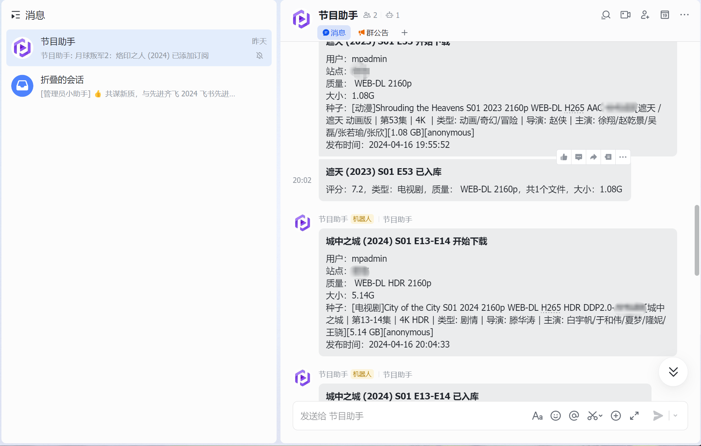
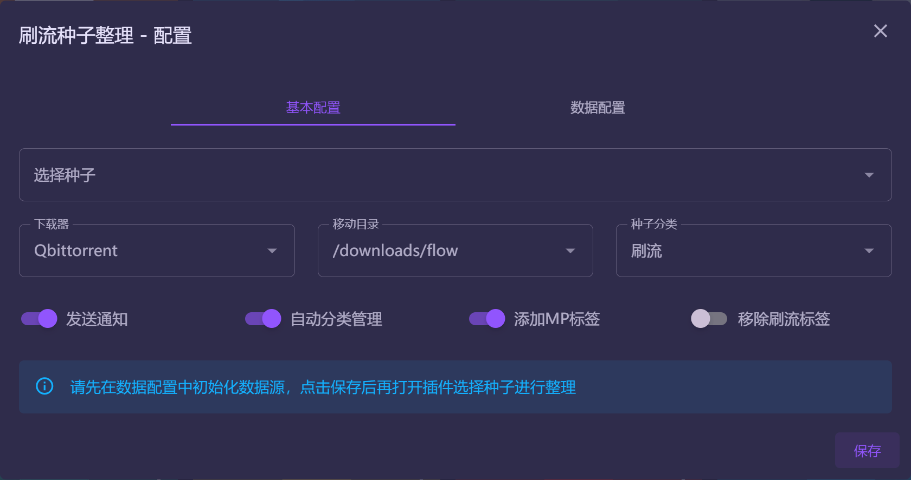
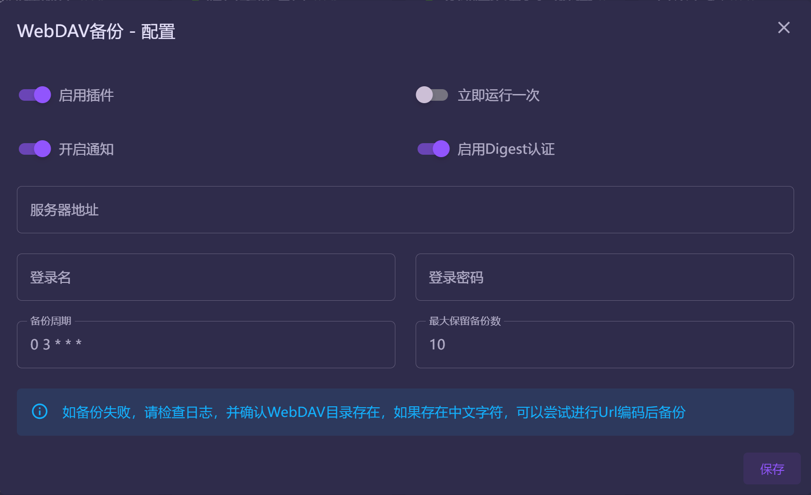
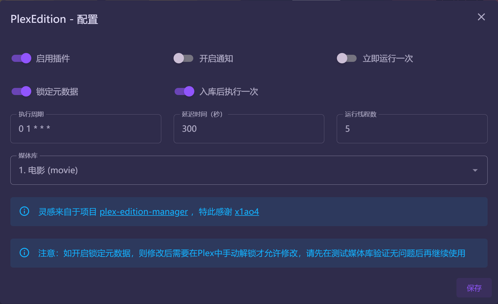
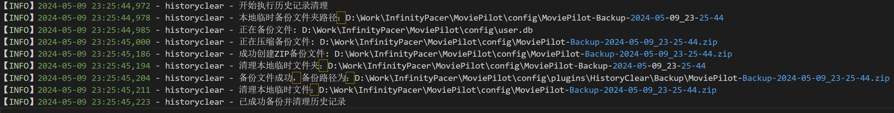
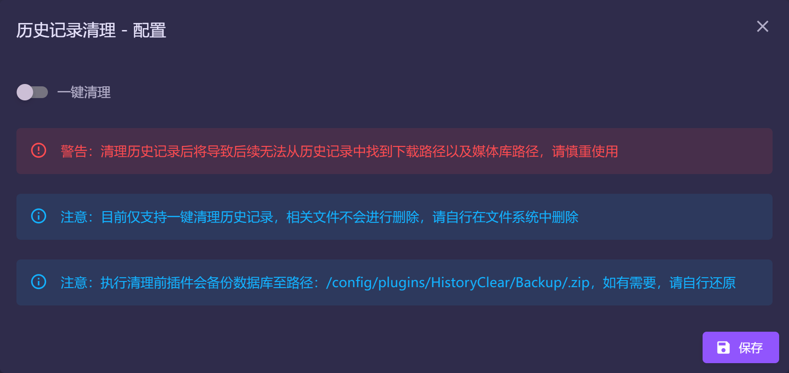
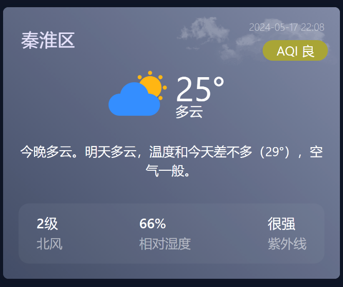
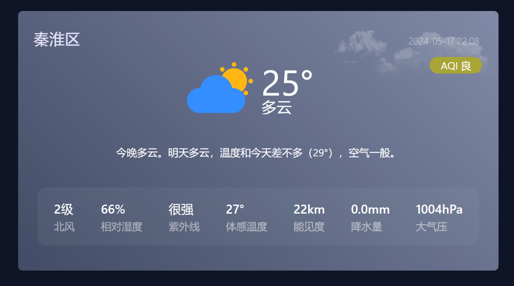
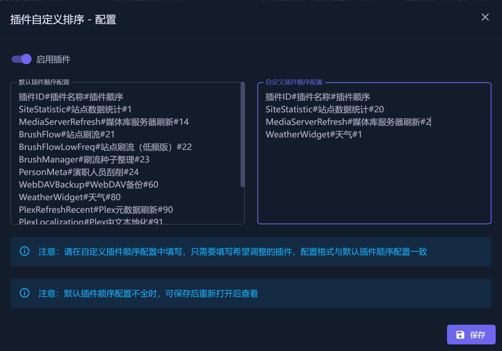
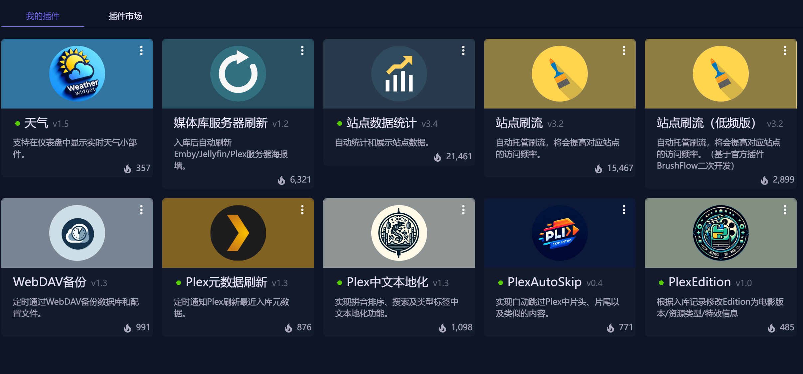

# MoviePilot-Plugins
MoviePilot三方插件：https://github.com/InfinityPacer/MoviePilot-Plugins

## 安装说明
MoviePilot环境变量添加本项目地址，具体参见 https://github.com/jxxghp/MoviePilot

## 插件说明

### 1. [站点刷流（低频版）](https://github.com/InfinityPacer/MoviePilot-Plugins/blob/main/plugins/brushflowlowfreq/README.md)

- 在官方刷流插件的基础上，新增了若干项功能优化了部分细节逻辑，目前已逐步PR至官方插件。在此，再次感谢 [@jxxghp](https://github.com/jxxghp) 提供那么优秀的开源作品。
- 详细配置说明以及刷流规则请参考 [README](https://github.com/InfinityPacer/MoviePilot-Plugins/blob/main/plugins/brushflowlowfreq/README.md)

### 2. 飞书机器人消息通知

- 详细使用参考飞书官方文档，[自定义机器人使用指南](https://open.feishu.cn/document/client-docs/bot-v3/add-custom-bot)

### 3. 插件热加载

- 直接在Docker中调试插件时，无需重启容器即可完成插件热加载

### 4. 刷流种子整理

- 针对刷流种子进行整理入库操作，目前仅支持QB
- 添加MP标签建议配合MP中的「监控默认下载器」选项
- 移除刷流标签建议配合刷流插件中的「下载器监控」选项
- 入库由MoviePliot的下载器监控或者目录监控完成，本插件仅提供种子操作如自动分类，添加MP标签等功能

### 5. Plex元数据刷新

- 定时通知Plex刷新最近入库元数据，从而支持部分剧集元数据更新滞后于发布日期，导致Plex没有及时更新

### 6. WebDAV备份

- 定时通过WebDAV备份数据库和配置文件。

### 7. Plex中文本地化

- 实现拼音排序、搜索及类型标签中文本地化功能。

#### 感谢

- 本插件基于 [plex_localization_zhcn](https://github.com/sqkkyzx/plex_localization_zhcn)，[plex-localization-zh](https://github.com/x1ao4/plex-localization-zh) 项目，实现了插件的相关功能。
- 特此感谢 [timmy0209](https://github.com/timmy0209)、[sqkkyzx](https://github.com/sqkkyzx)、[x1ao4](https://github.com/x1ao4)、[anooki-c](https://github.com/anooki-c) 等贡献者的卓越代码贡献。
- 如有未能提及的作者，请告知我以便进行补充。

### 8. [PlexAutoSkip](https://github.com/InfinityPacer/PlexAutoSkip)

- 实现自动跳过Plex中片头、片尾以及类似的内容。
- 目前支持的Plex客户端，参考如下
  - Plex for iOS
  - Plex for Apple TV
- 由于Plex调整，部分客户端仅部分版本支持，仅供参考
  - Plex Web
  - Plex for Windows
  - Plex for Mac
  - Plex for Linux
  - Plex for Roku
  - Plex for Android (TV)
  - Plex for Android (Mobile)
- 相关配置请参考[说明](https://github.com/InfinityPacer/PlexAutoSkip/blob/master/README.md)以及[Wiki](https://github.com/InfinityPacer/PlexAutoSkip/wiki)

#### 感谢

- 本插件基于 [PlexAutoSkip](https://github.com/mdhiggins/PlexAutoSkip) 项目，实现了插件的相关功能，特此感谢 [mdhiggins](https://github.com/mdhiggins) 的卓越代码贡献。
- 如有未能提及的作者，请告知我以便进行补充。

### 9. PlexEdition

- 根据入库记录修改Edition为电影版本/资源类型/特效信息，字段来源于[MOVIE_RENAME_FORMAT](https://github.com/jxxghp/MoviePilot?tab=readme-ov-file#2-%E7%8E%AF%E5%A2%83%E5%8F%98%E9%87%8F--%E9%85%8D%E7%BD%AE%E6%96%87%E4%BB%B6)中的**edition**版本（资源类型+特效）

#### 感谢

- 灵感来自于项目 [plex-edition-manager](https://github.com/x1ao4/plex-edition-manager) ，特此感谢 [x1ao4](https://github.com/x1ao4)。
- 如有未能提及的作者，请告知我以便进行补充。

### 10. 历史记录清理

- 清理历史记录后将导致后续无法从历史记录中找到下载路径以及媒体库路径，请慎重使用
- 清理历史记录前请先对/config/user.db文件进行备份，以便出现异常后能够还原
- 目前仅支持一键清理历史记录，相关文件不会进行删除，请自行在文件系统中删除
- 执行清理前插件会备份数据库至路径：/config/plugins/HistoryClear/Backup/.zip，如有需要，请自行还原

### 11. 天气

- 支持在仪表盘中显示实时天气小部件，方便用户随时查看天气情况
- 通过在和风天气官网获取对应链接精确定位城市，如「[秦淮区](https://www.qweather.com/weather/qinhuai-101190109.html)」的链接填写为「qinhuai-101190109」

#### 感谢

 - 天气数据来源于[和风天气](https://www.qweather.com/)，再次感谢[和风天气](https://www.qweather.com/)提供的服务

### 12. 插件自定义排序

- 支持将插件按自定义顺序排序

