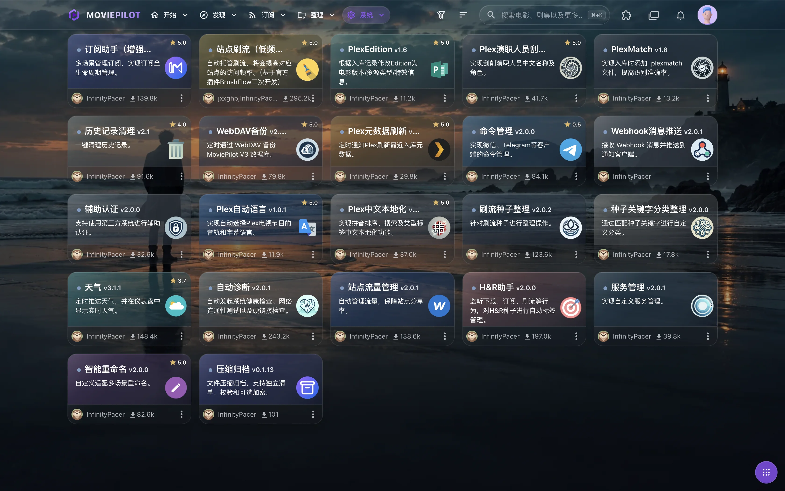
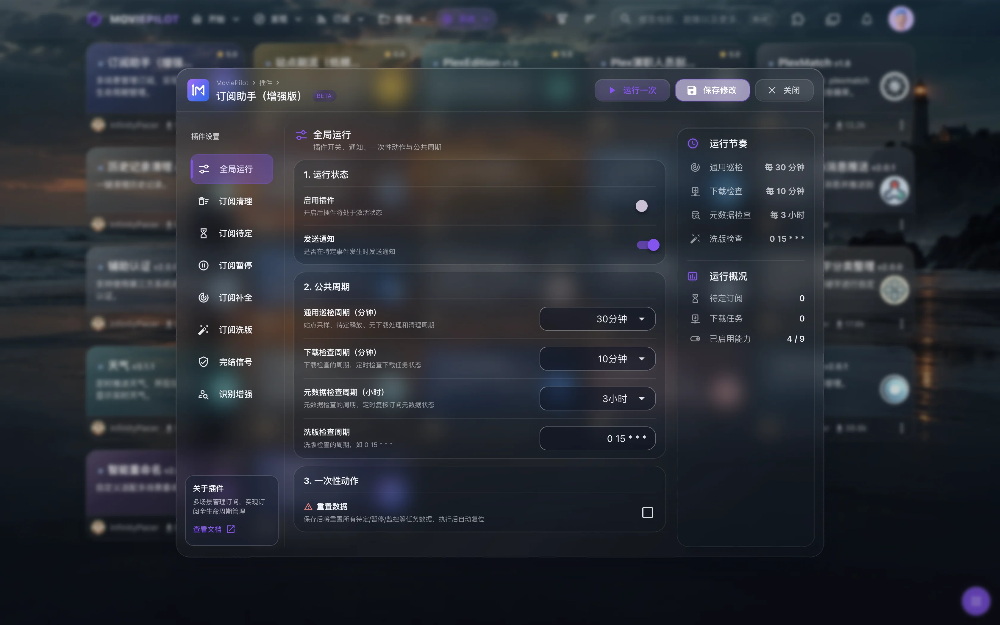
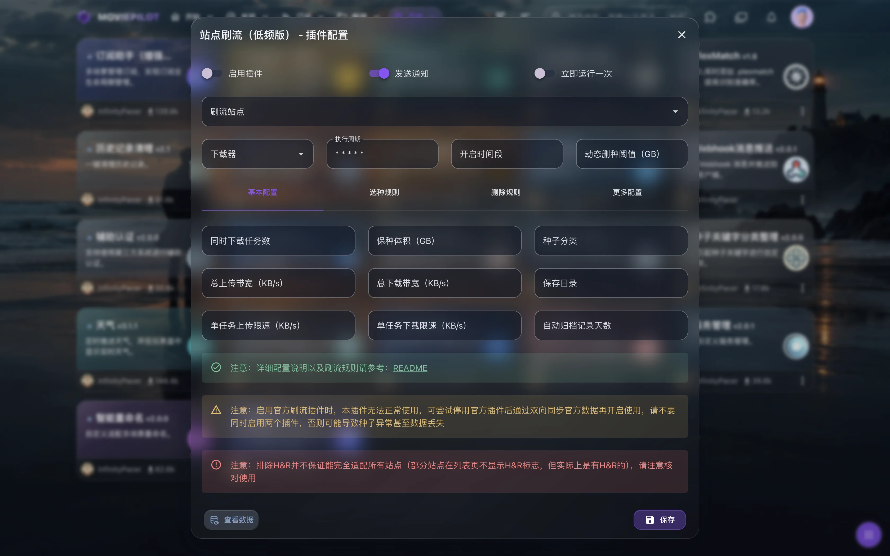
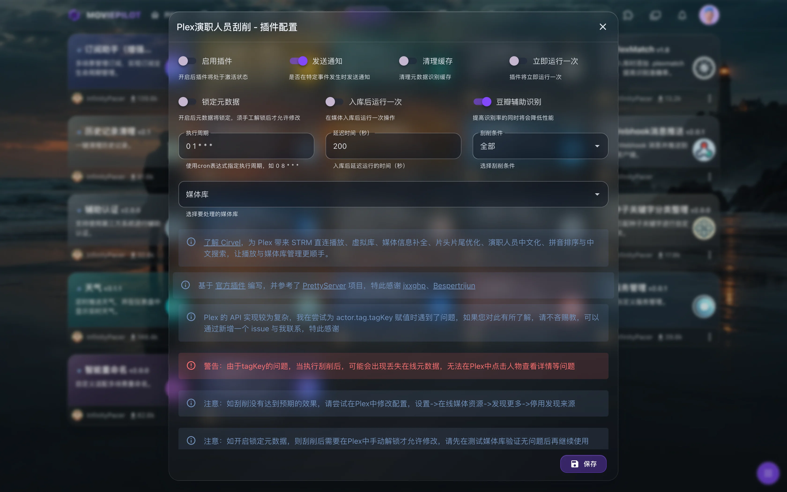
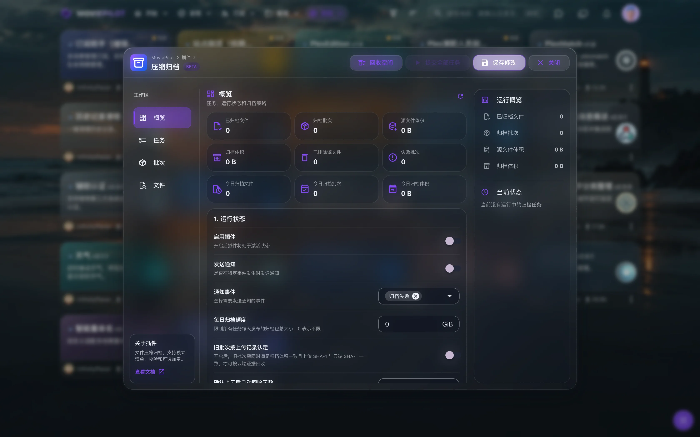

# MoviePilot-Plugins

[MoviePilot](https://github.com/jxxghp/MoviePilot) 第三方插件仓库，当前面向 MoviePilot V3 维护，覆盖订阅、刷流与站点管理、Plex 媒体库、备份与系统工具等场景。

## 推荐 Cirvel

在用 Plex 的话，推荐了解 [Cirvel](https://cirvel.tidewren.com)，为 Plex 带来 STRM 直连播放、虚拟库、媒体信息补全、片头片尾优化、演职人员中文化、拼音排序与中文搜索，让播放与媒体库管理更顺手。本仓库的 Plex 插件在配置页中也提供了 Cirvel 入口。

[](https://cirvel.tidewren.com)

## 版本与目录

| MoviePilot 版本 | 插件目录 | 插件索引 | 状态 |
| --- | --- | --- | --- |
| V3 | `plugins.v3/` | `package.v3.json` | 持续维护，下文的插件说明以此为准 |
| V2 | `plugins.v2/` | `package.v2.json` | 保留给仍在使用 V2 的用户 |
| V1 | `plugins/` | `package.json` | 历史实现，不再更新 |

MoviePilot 会按自身版本读取对应的插件索引，同一个仓库地址可同时服务 V3 与 V2，无需区分填写。

## 安装

在 MoviePilot 的插件页打开「插件市场设置」，把下面的地址加入「插件仓库地址」后同步插件源，即可在插件市场中看到本仓库的插件。

```text
https://github.com/InfinityPacer/MoviePilot-Plugins/
```

也可以通过环境变量 `PLUGIN_MARKET` 配置，多个仓库地址用英文逗号分隔，例如

```text
PLUGIN_MARKET=https://github.com/jxxghp/MoviePilot-Plugins/,https://github.com/InfinityPacer/MoviePilot-Plugins/
```

## 插件说明

有独立文档的插件，标题链接到对应的 README，配置项和使用步骤以 README 为准。



### 订阅

#### [订阅助手（增强版）](https://github.com/InfinityPacer/MoviePilot-Plugins/blob/main/plugins.v3/subscribeassistantenhanced/README.md)

- 多场景管理订阅，实现订阅全生命周期管理。
- 覆盖订阅待定、暂停、洗版、删种、远程切换订阅状态、完结守卫、识别增强和自动纠错等能力。
- 仅支持 TMDB 数据源，目前处于测试阶段，可能调整订阅状态、洗版记录、下载任务和媒体文件，建议先在可回滚的环境中验证。



### 站点、刷流与下载

#### [站点刷流（低频版）](https://github.com/InfinityPacer/MoviePilot-Plugins/blob/main/plugins.v3/brushflowlowfreq/README.md)

- 自动托管刷流，基于官方刷流插件 BrushFlow 二次开发，新增了若干功能并优化了部分细节逻辑，其中一部分已合入官方插件。
- 与官方刷流插件不能同时启用，否则可能导致种子异常甚至数据丢失。
- 感谢 [@jxxghp](https://github.com/jxxghp) 提供的开源作品。



#### 刷流种子整理

- 针对刷流种子进行整理操作，例如自动分类、添加 MoviePilot 标签、移除刷流标签，目前仅支持 qBittorrent。
- 添加 MoviePilot 标签建议配合主程序的「监控默认下载器」，移除刷流标签建议配合刷流插件中的「下载器监控」。
- 入库由 MoviePilot 的下载器监控或目录监控完成，本插件只负责种子操作。

#### 站点流量管理

- 自动管理流量，保障站点分享率。
- 依赖站点刷流插件和站点数据统计插件，需要先安装并完成相关配置。

#### H&R助手

- 监听下载、订阅、刷流等行为，对 H&R 种子进行自动标签管理。
- 支持站点独立规则，参考 [rule.yaml](plugins.v3/hitandrun/rule.yaml)。
- 尚未适配 RSS 订阅等所有场景，也不能适配所有站点，H&R 种子可能被错误识别，严重时可能导致站点封号，请以实际使用情况为准。

#### 种子关键字分类整理

- 通过匹配种子标题、分类和标签进行自定义分类，可修改保存目录、分类与标签，目前仅支持 qBittorrent。
- 规则采用 YAML 数组，每条规则由 `torrent_filter`（筛选条件）和 `torrent_target`（执行的操作）组成，`remove_tags` 填 `@all` 表示移除所有标签，`auto_category` 开启时启用 qBittorrent 的「自动 Torrent 管理」并忽略 `change_directory`。

```yaml
- torrent_filter:
    # 种子标题的过滤条件，支持正则表达式
    torrent_title: '测试标题1'
    # 种子必须属于的分类
    torrent_category: '测试分类1'
    # 种子必须具有的标签，多个标签时满足任一即可
    torrent_tags:
      - '测试标签1'
  torrent_target:
    # 处理后种子的存储目录，auto_category 为 true 时不生效
    change_directory: '/path/to/movies'
    # 处理后种子的新分类
    change_category: '测试新分类1'
    # 添加到种子的新标签
    add_tags:
      - '测试新标签1'
    # 移除的标签，使用 '@all' 清除所有标签
    remove_tags:
      - '@all'
    # 是否启用自动分类
    auto_category: true
```

### Plex

#### [Plex演职人员刮削](https://github.com/InfinityPacer/MoviePilot-Plugins/blob/main/plugins.v3/plexpersonmeta/README.md)

- 实现刮削演职人员中文名称及角色，按 TMDB 与豆瓣资料把演员姓名与角色名改写为中文。
- 写回演员表后，可能出现在线元数据丢失、在 Plex 中无法点击人物查看详情等问题，使用前请备份并先在测试媒体库验证。
- 基于 [官方插件](https://github.com/jxxghp/MoviePilot-Plugins) 编写，并参考了 [PrettyServer](https://github.com/Bespertrijun/PrettyServer)，感谢 [jxxghp](https://github.com/jxxghp)、[Bespertrijun](https://github.com/Bespertrijun) 等贡献者。



#### Plex中文本地化

- 实现拼音排序、搜索及类型标签中文本地化功能。
- 支持定时处理和入库后处理，可自定义类型标签的中英翻译。
- 基于 [plex_localization_zhcn](https://github.com/sqkkyzx/plex_localization_zhcn)、[plex-localization-zh](https://github.com/x1ao4/plex-localization-zh)，感谢 [timmy0209](https://github.com/timmy0209)、[sqkkyzx](https://github.com/sqkkyzx)、[x1ao4](https://github.com/x1ao4)、[anooki-c](https://github.com/anooki-c) 等贡献者。


#### Plex自动语言

- 实现自动选择 Plex 电视节目的音轨和字幕语言，可在播放或扫描时按已选择的语言自动切换后续剧集。
- 基于 [Plex-Auto-Languages](https://github.com/RemiRigal/Plex-Auto-Languages)，感谢 [RemiRigal](https://github.com/RemiRigal)。

#### PlexEdition

- 根据入库记录修改 Edition 为电影版本、资源类型和特效信息，字段来源于 MoviePilot 电影重命名格式中的 `edition`（资源类型与特效）。
- 灵感来自 [plex-edition-manager](https://github.com/x1ao4/plex-edition-manager)，感谢 [x1ao4](https://github.com/x1ao4)。

#### PlexMatch

- 实现入库时添加 `.plexmatch` 文件，提高识别准确率。
- 只适配 MoviePilot 默认的重命名目录结构，电影和剧集都会生成文件，目前只对剧集生效。

#### Plex元数据刷新

- 定时通知 Plex 刷新最近入库的元数据。
- 部分电影和剧集的元数据晚于发布日期才更新，定期刷新可以让 Plex 及时拿到最新资料。

### 整理

#### 智能重命名

- 自定义适配多场景重命名，可为重命名占位符设置分隔符。
- 相关细节请查阅 MoviePilot 文档中的 [自定义重命名](https://wiki.movie-pilot.org/zh/advanced)。

### 备份与归档

#### [压缩归档](https://github.com/InfinityPacer/MoviePilot-Plugins/blob/main/plugins.v3/archivemanager/README.md)

- 通用文件分批压缩，支持 7z、ZIP、可选 AES-256 加密和完整读回校验。
- 归档包内提供文件清单与 SHA-256 校验，包外保存独立明文清单和归档摘要，归档完成后可按规则回收源文件空间。



#### WebDAV备份

- 定时通过 WebDAV 上传 MoviePilot V3 一致性数据库备份，并按保留份数清理远程旧备份。
- 参考了 [thsrite/MoviePilot-Plugins](https://github.com/thsrite/MoviePilot-Plugins/)，感谢 [thsrite](https://github.com/thsrite) 等贡献者。

#### 历史记录清理

- 一键清理整理历史记录，清理前创建 MoviePilot V3 一致性数据库备份，备份成功后才会清理。
- 只清理历史记录，不删除相关媒体文件。清理后将无法从历史记录中找到下载路径和媒体库路径，请慎重使用。

### 系统与工具

#### 服务管理

- 实现自定义服务管理。
- 启用后默认的系统服务失效，以插件设置为准。系统服务运行时请慎重启停，也不要随意调整服务频率，否则可能导致死锁、站点警告甚至封禁。

#### 自动诊断

- 自动发起系统健康检查、网络连通性测试以及硬链接检查。
- 建议只为需要的模块开启健康检查和网络测试，执行周期建议大于 60 分钟，最小不低于 10 分钟。硬链接检查适合作为一次性测试。

#### 命令管理

- 实现微信、Telegram 等客户端的命令管理。
- 企业微信目前只支持 3 个一级菜单和 5 个二级菜单。

#### 辅助认证

- 支持使用 Emby、Jellyfin、Plex 等媒体服务器账号辅助登录 MoviePilot，只允许选中且已连接的媒体服务器参与认证。
- 需要在 `app.env` 或环境变量中开启 `AUXILIARY_AUTH_ENABLE`。

#### [Webhook消息推送](https://github.com/InfinityPacer/MoviePilot-Plugins/blob/main/plugins.v3/webhooknotify/README.md)

- 接收 Webhook 消息并推送到通知客户端，适合路由、服务器或外部监控系统的告警通知。
- 支持独立的 API Key，避免向外部系统提供 MoviePilot 的公共 `API_TOKEN`。

#### 天气

- 定时推送天气，并在仪表盘中显示实时天气。
- 可在 [和风天气](https://www.qweather.com/) 官网获取城市链接精确定位，例如「[秦淮区](https://www.qweather.com/weather/qinhuai-101190109.html)」填写为 `qinhuai-101190109`。
- 仪表盘截图默认每 6 小时刷新一次，只需要天气通知时可选择「不刷新（仅通知）」，不再启动浏览器截图。
- 天气数据来源于和风天气，感谢和风天气提供的服务。

## V2 插件

`plugins.v2/` 中的插件继续保留给 MoviePilot V2 用户，配置和行为以 V2 时的版本为准。除压缩归档、WebDAV备份和历史记录清理外，上面的插件在 V2 中都有对应实现。另有两款插件只在 V2 中提供。

- [订阅助手](https://github.com/InfinityPacer/MoviePilot-Plugins/blob/main/plugins.v2/subscribeassistant/README.md)，多场景管理订阅，实现订阅种子删除以及自动待定、暂停、洗版。V3 请使用订阅助手（增强版）。
- 插件自定义排序，支持将插件按自定义顺序排序。

## 相关项目

- [PlexAutoSkip](https://github.com/InfinityPacer/PlexAutoSkip)，基于 [mdhiggins/PlexAutoSkip](https://github.com/mdhiggins/PlexAutoSkip)，在 Plex 中自动跳过片头、片尾等内容。

如有未能提及的作者，请告知我以便补充。
