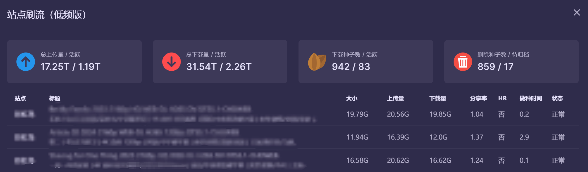
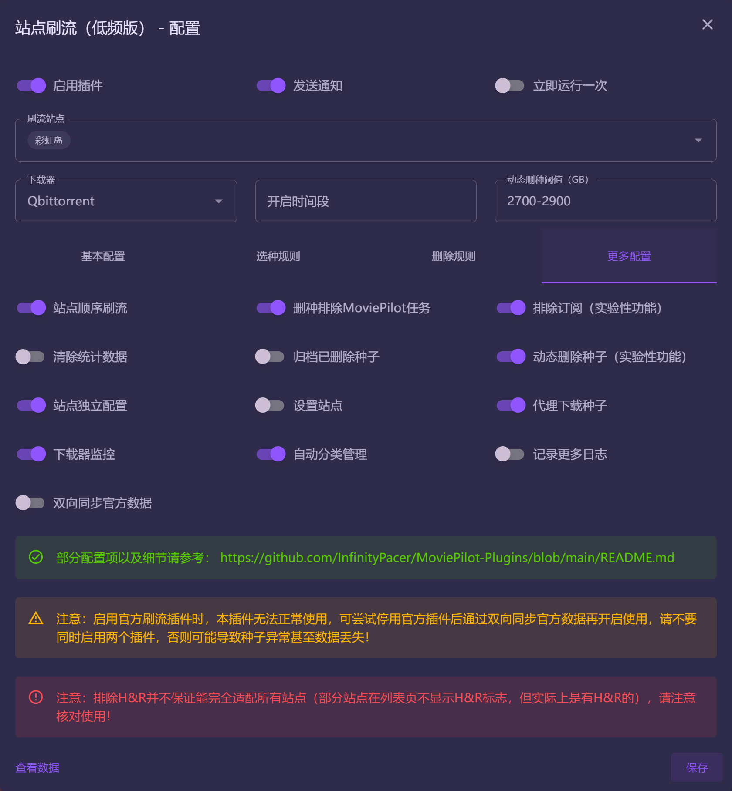

# 站点刷流（低频版）

在官方刷流插件的基础上，新增了若干项功能优化了部分细节逻辑，目前已逐步PR至官方插件。在此，再次感谢 [@jxxghp](https://github.com/jxxghp) 提供那么优秀的开源作品。

## 版本更新日志

- v3.2
  - 支持推送QB种子时启用「先下载首尾文件块」选项

- v3.1
  - 同步官版更新，支持仪表板显示站点刷流数据，需要主程序升级v1.8.7+版本

- v3.0
  - 优化不同站点刷流到相同种子的逻辑，部分日志优化

- v2.9
  - 优化动态删除消息推送
  - 优化配置页UI显示及部分配置项
  - 支持配置种子分类以及开启自动分类管理
  - 取消单独适配站点时区逻辑，可通过配置项「pubtime」自行适配

- v2.8
  - 同步官版更新，优化UI显示及部分配置项

- v2.7
  - 动态删除种子规则调整，见[动态删除规则](#动态删除规则)
  - 站点独立配置样式优化、日志优化
  - 修复部分配置项无法配置小数的问题 
  - 修复部分场景可能导致重复下载的问题

- v2.6
  - 进一步优化订阅排除匹配逻辑，从媒体库缓存中读取订阅别名作为标题，提高排除命中率
  - 鉴于部分用户对刷流操作和对应的风险没有充分认知，插件配置中相关的提示置顶显示

- v2.5
  - 增加H&R做种时间配置项，当配置了H&R做种时间/分享率时，则H&R种子只有达到预期行为时，才会进行删除，如果没有配置H&R做种时间/分享率，则普通种子的删除规则也适用于H&R种子
    - **请注意，H&R并不保证能完全适配所有站点（部分站点在列表页不显示H&R标志，但实际上是有H&R的），请注意核对使用**
  - 增加下载器监控配置项，开启开关后，**刷流种子自动监控管理**才会生效，否则不会生效
  - 刷流前置条件调整，原有逻辑为保种体积 > 实际做种体积，则允许继续刷流，调整为保种体积 > (实际做种体积 + 种子大小下限) 时，才允许继续刷流，进一步降低刷流频率，如果没有配置种子大小，则与原有逻辑保持一致
  - 鉴于部分用户无法理解代理下载种子的逻辑，默认关闭代理下载种子，如日志中出现下载种子失败的情况，可检查下载器网络能否正常访问站点或对代理下载种子有充分认知后开启选项

- v2.4.2
  - 消息推送策略调整，部分场景下，消息合并推送，如无效种子更新状态等
  - 清除统计数据策略调整为彻底重置所有刷流数据，如当前还存在正在做种的刷流任务，待定时检查任务执行后，会自动纳入刷流管理

- v2.4.1
  - 部分站点刷流下载种子策略调整，避免刷流下载失败
  - 手工刷流同步tracker映射站点策略调整，避免映射失败导致统计异常的问题

- v2.4 
  - 数据页增加做种时间列
  - 动态删除种子规则调整：优先删除满足用户设置删除规则的**全部种子**，**出于上传资源的考虑，即便在删除过程中已经低于了阈值下限，也会继续删除**，若删除后还没有达到阈值，则在完成种子中排除H&R种子后按~~加入时间正序~~**做种时间倒序**进行删除
  - 修复增加MP标签后，提示种子被删除的问题
  - 日志进一步优化可读性

## 开发计划

- [ ] **动态删除种子（实验性功能）规则调整**：已调整部分规则，评估即便没有触发删除阈值，也按对应的删种条件执行删除操作，即如果用户配置了删除条件，则每次刷流检查服务都会按用户设置的条件执行删除操作（排除H&R种子），然后再执行动态删除逻辑
- [ ] **刷流辅种删除优化**：如果其他站点在辅种且不满足删种条件，则跳过
- [ ] **站点独立配置支持保种体积**：在站点独立配置中，增加保种体积的支持，在删除种子时，根据站点独立配置进行删除，如果部分站点没有配置保种体积的，以全局配置为准
- [ ] **删除种子时汇报Tracker**：删除种子时，调用下载器接口汇报一次Tracker，避免汇报数据丢失
- [ ] **适配跳过站点首次下载**：部分站点存在首次下载种子提示页，支持自动跳过

## 新增功能

- [x] **支持QB先下载首尾文件块**：支持推送QB种子时启用「先下载首尾文件块」选项（v3.2）
- [x] **种子分类管理**：支持配置「种子分类」以及「自动分类管理」，向下载器推送种子时，按对应配置项进行推送（仅支持qBittorrent）（v2.9）
- [x] **H&R做种时间**：增加H&R做种时间配置项，当配置了H&R做种时间/分享率时，则H&R种子只有达到预期行为时，才会进行删除，如果没有配置H&R做种时间/分享率，则普通种子的删除规则也适用于H&R种子 (v2.5)
- [x] **下载器监控**：开启开关后，**刷流种子自动监控管理**才会生效，否则不会生效 (v2.5)
- [x] **记录更多日志**：开启开关后，日志中会记录更多刷流日志，以便更好决策刷流条件 (v2.2)
- [x] **双向同步官方插件数据**：一次性将本插件与官方插件的数据进行同步，如遇重复项，已本插件的数据为准 (v2.1)
- [x] **动态删除种子**（实验性功能）：~~当做种体积超过设定的动态删除阈值时，自动执行种子删除规则，优化存储管理 (v2.0)~~ 动态删除种子，见[动态删除规则](#动态删除规则) (v2.7)
- [x] **刷流服务时间控制**：可配置刷流服务的开启时间段，不在时间范围内时自动跳过定时任务 (v1.9)
- [x] **刷流种子自动监控管理**：监控下载器中所有种子，在增加/删除刷流标签或删除/恢复种子后，自动纳入/排除刷流管理 (v1.8)
  - 同步种子刷流标签记录目前仅支持qbittorrent (v1.8)
  - 开启下载器监控后，该功能才会生效 (v2.5) 
- [x] **种子数据管理**：支持归档已删除种子，并在数据页中展示活跃及归档种子统计 (v1.7)
- [x] **站点独立配置**：部分规则（如hr，做种时间）现支持按站点独立配置，具体详情见[站点独立配置](#站点独立配置) (v1.7)
- [x] **代理下载支持**：通过MP下载种子后推送下载器，解决下载器无法正常访问种子Url，导致下载种子失败，无法正常获取到种子Hash问题 (v1.6)
- [x] **站点顺序刷流**：支持配置是否按照选择的站点顺序进行刷流，或者在多站点刷流时随机选择站点刷流，避免固定刷某站点，进一步降低无效请求 (v1.6)
- [x] **刷流检查定时任务**：无需勾选站点也支持定时任务正常执行刷流检查和删种操作 (v1.5)
- [x] **排除订阅内容**（实验性功能）：自动过滤订阅内容标题，简化刷流筛选过程 (v1.5)
- [x] **刷流筛选增强**：支持种子副标题包含/排除匹配规则，使刷流筛选更加精准 (v1.5)
- [x] **下载器种子删除与刷流管理同步**：种子删除时，若已纳入刷流管理，则同步更新刷流列表，确保信息的一致性 (v1.4)
- [x] **删种排除规则调整**：下载器配置MP标签后，删种检查过程中将自动排除处理MoviePilot任务，减少不必要的操作干扰 (v1.4)

## 优化项

- [x] **排除订阅（实验性功能）优化**：进一步优化订阅排除匹配逻辑，从媒体库缓存中读取订阅别名作为标题，提高排除命中率（v2.6）
- [x] **刷流前置条件判断优化**：刷流前置条件中，原有逻辑为保种体积 > 实际做种体积，则允许继续刷流，调整为保种体积 > (实际做种体积 + 种子大小下限) 时，才允许继续刷流，进一步降低刷流频率，如果没有配置种子大小，则与原有逻辑保持一致 (v2.5)
- [x] **消息推送优化**：部分场景下，消息合并推送，如无效种子更新状态等 (v2.4.2)
- [x] **做种体积判断优化**：调整做种体积判断策略，除前置判断外，筛选种子时优化判断 (v2.2)
- [x] **清除统计数据调整**：~~调整数据清理策略，只清理已删除和已归档数据，保留活跃种子信息 (v1.9)~~
  - 彻底重置所有刷流数据，如当前还存在正在做种的刷流任务，待定时检查任务执行后，会自动纳入刷流管理 (v2.4.2)
- [x] **刷流消息通知**：通知消息中加入副标题显示，提供更完整的信息 (v1.8)
- [x] **数据页显示改进**：数据页现支持显示种子副标题，增强信息的可读性 (v1.7)
- [x] **后台服务与配置逻辑重构**：通过重构刷流后台服务和配置逻辑，进一步降低请求频率和提高配置灵活性 (v1.6)
- [x] **日志记录优化**：部分日志记录调整优化 (v1.5)
- [x] ~~**时区问题修正**：修正部分站点时区为UTC+0导致的发布时间不匹配问题 (v1.4)~~
- [x] **前置过滤条件判断优化**：刷流时，优先判断前置过滤条件，以降低对站点的请求频率 (v1.4)

## 定时服务

  - Brush服务，每10分钟执行一次，用于请求站点下载刷流种子。
  - Check服务，每5分钟执行一次，用于同步检查下载器刷流种子信息，删除种子，更新统计等。

## 配置说明

| 配置项                 | 标识                  | 说明                                       | 备注                                                                                                                |
| ---------------------- | --------------------- | ------------------------------------------ | ------------------------------------------------------------------------------------------------------------------- |
| 启用插件               | `enabled`             | 控制插件是否启用                           |                                                                                                                     |
| 发送通知               | `notify`              | 是否启用发送通知功能                       |                                                                                                                     |
| 立即运行一次           | `onlyonce`            | 立即执行一次操作                           | Brush&Check服务均会执行                                                                                             |
| 刷流站点               | `brushsites`          | 选择要刷流的站点                           | 没有选择站点，但是启用插件时，Brush服务不会执行，Check服务会正常执行                                                |
| 下载器                 | `downloader`          | 选择使用的下载客户端                       |                                                                                                                     |
| 保种体积（GB）         | `disksize`            | 刷流任务（正常）达到指定体积后停止刷流任务 | 保种体积 > (刷流任务体积 + 种子大小下限) 时，允许继续刷流任务                                                       |
| 种子分类               | `qb_category`         | 刷流推送下载器的种子分类                   | 仅支持QB，配置后保存目录配置项失效，需提前在下载器中创建                                                            |
| 促销                   | `freeleech`           | 根据促销类型过滤任务                       | 包括全部、免费、2X免费。免费包括2X免费                                                                              |
| 排除H&R                | `hr`                  | 是否排除有H&R（Hit and Run）要求的任务     |                                                                                                                     |
| 总上传带宽（KB/s）     | `maxupspeed`          | 达到设定的上传带宽后停止刷流任务           |                                                                                                                     |
| 总下载带宽（KB/s）     | `maxdlspeed`          | 达到设定的下载带宽后停止刷流任务           |                                                                                                                     |
| 同时下载任务数         | `maxdlcount`          | 设置同时下载的最大任务数                   |                                                                                                                     |
| 包含规则               | `include`             | 设置包含的刷流规则（支持正则表达式）       | 种子标题、副标题任一匹配                                                                                            |
| 排除规则               | `exclude`             | 设置排除的刷流规则（支持正则表达式）       | 种子标题、副标题任一匹配                                                                                            |
| 种子大小（GB）         | `size`                | 设置任务的种子大小过滤                     | 示例：<br>5，种子体积 >= 5GB <br> 5-10，5GB <= 种子体积 <= 10GB                                                     |
| 做种人数               | `seeder`              | 设置做种人数过滤                           | 示例：<br>5，做种人数 <= 5 <br> 5-10，5 <= 做种人数 <= 10                                                           |
| 发布时间（分钟）       | `pubtime`             | 设置任务的发布时间过滤                     | 示例：<br>5，发布时间 <= 5 <br> 5-10，5 <= 发布时间 <= 10 <br> 部分站点时间为UTC+0，可通过配置项「pubtime」自行适配 |
| 做种时间（小时）       | `seed_time`           | 达到指定做种时间后删除任务                 |                                                                                                                     |
| H&R做种时间（小时）    | `hr_seed_time`        | 对于H&R任务，达到指定做种时间后删除任务    | 如果没有配置H&R做种时间/分享率，则普通种子的删除规则也适用于H&R种子                                                 |
| 动态删种阈值（GB）     | `delete_size_range`   | 设置动态删种的体积阈值                     | 见[动态删除规则](#动态删除规则)                                                                                     |
| 分享率                 | `seed_ratio`          | 达到设定分享率后删除任务                   | 如果没有配置H&R做种时间/分享率，则普通种子的删除规则也适用于H&R种子                                                 |
| 上传量（GB）           | `seed_size`           | 达到设定上传量后删除任务                   |                                                                                                                     |
| 下载超时时间（小时）   | `download_time`       | 达到指定下载超时时间后删除任务             |                                                                                                                     |
| 平均上传速度（KB/s）   | `seed_avgspeed`       | 低于设定的平均上传速度时删除任务           | 刷流任务做种30分钟后才会生效                                                                                        |
| 未活动时间（分钟）     | `seed_inactivetime`   | 超过设定的未活动时间后删除任务             |                                                                                                                     |
| 单任务上传限速（KB/s） | `up_speed`            | 设置每个种子的上传限速                     |                                                                                                                     |
| 单任务下载限速（KB/s） | `dl_speed`            | 设置每个种子的下载限速                     |                                                                                                                     |
| 保存目录               | `save_path`           | 设置种子保存的目录                         |
| 开启时间段             | `active_time_range`   | 设置插件Brush和Check的活动时间段           | 如00:00-08:00                                                                                                       |
| 站点顺序刷流           | `brush_sequential`    | 是否按选择的站点顺序进行刷流               | 关闭选项时，按选择的站点随机顺序进行刷流                                                                            |
| 删种排除MoviePilot任务 | `except_tags`         | 删除任务时排除带有MoviePilot标签的任务     | MoviePilot标签指环境变量中配置的TORRENT_TAG，默认为MoviePilot                                                       |
| 排除订阅               | `except_subscribe`    | 刷流时排除订阅内容的相关种子               | **实验性功能**，可能会导致刷流时无法正常下载种子，请慎重开启                                                        |
| 清除统计数据           | `clear_task`          | 是否启用清除统计数据功能                   | 一次性任务，自动将插件数据页中的所有数据重置后，配置项重置为关闭                                                    |
| 归档已删除种子         | `archive_task`        | 是否启用归档已删除种子的功能               | 一次性任务，自动将插件数据页中的已删除数据进行归档后，配置项重置为关闭                                              |
| 动态删除种子           | `proxy_delete`        | 是否启用动态删除种子                       | **实验性功能**，可能会导致刷流数据异常，甚至清空，请慎重开启，见[动态删除规则](#动态删除规则)                       |
| 站点独立配置           | `enable_site_config`  | 是否启用站点独立配置                       | 见[站点独立配置](#站点独立配置)                                                                                     |
| 打开站点配置窗口       | `dialog_closed`       | 控制站点独立配置页面的显示状态           | 点击即可打开站点独立配置页面的窗口                                                                                  |
| 代理下载种子           | `proxy_download`      | 通过MP下载种子后推送下载器                 | 解决下载器无法正常访问种子Url，导致下载种子失败，无法正常获取到种子Hash的问题。见[FAQ](#faq)                        |
| 下载器监控             | `downloader_monitor`  | 是否启用下载器监控功能                     | 监控下载器中所有种子，在增加/删除「刷流」标签或删除/恢复种子后，自动纳入/排除刷流管理                               |
| 自动分类管理           | `auto_qb_category`    | 是否启用自动分类管理                       | 仅支持QB，开启后，种子推送下载器时会自动开启「自动Torrent管理」，「保存目录」配置项将会失效，请提前在QB配置         |
| 优先下载首尾文件块     | `qb_first_last_piece` | 是否启用优先下载首尾文件块                 | 仅支持QB，开启后，种子推送下载器时会自动开启「先下载首尾文件块」                                                    |
| 记录更多日志           | `log_more`            | 是否启用记录更多日志的功能                 | 日志中会记录更多刷流日志，以便更好决策刷流条件                                                                      |
| 双向同步官方插件数据   | `sync_official`       | 是否启用双向同步官方插件数据的功能         | 将官版以及本插件的刷流任务数据进行合并，如存在重复刷流任务，默认已本插件的为准。                                    |

## 动态删除规则
  - 当开启动态删除种子以及设置动态删除阈值时，动态删除规则开始生效，具体如下：
    - 不管做种体积是否超过设定的动态删除阈值，默认优先执行排除H&R种子后满足「下载超时时间」的种子
    - 上述规则执行完成后，当做种体积依旧超过设定的动态删除阈值时，继续执行下述种子删除规则
    - 优先删除满足用户设置删除规则的全部种子，即便在删除过程中已经低于了阈值下限，也会继续删除
    - 若删除后还没有达到阈值，则在已完成种子中排除H&R种子后按做种时间倒序进行删除
    - 动态删除阈值：100，当做种体积 > 100G 时，则开始删除种子，直至降低至 100G
    - 动态删除阈值：50-100，当做种体积 > 100G 时，则开始删除种子，直至降至为 50G

## 站点独立配置

目前站点独立配置支持以下配置项，配置格式为json，通过sitename进行匹配，没有找到对应配置项时，则以全局配置项为准，**请注意，如与全局保持一致的配置项，请勿在站点配置中配置，此外hr配置项为排除H&R，请按下述内容进行配置，配置完成后，请在日志查看是否配置成功**，可打开**记录更多日志**配置项以便更好排查问题。

- `sitename`: 站点名称
- `freeleech`: 促销
  - `''`: 全部（包括普通）
  - `'free'`: 免费
  - `'2xfree'`: 2X免费
- `hr`: 排除H&R
  - `'yes'`: 是
  - `'no'`: 否
- `include`: 包含规则
- `exclude`: 排除规则
- `size`: 种子大小
- `seeder`: 做种人数
- `pubtime`: 发布时间
- `seed_time`: 做种时间
- `seed_ratio`: 分享率
- `seed_size`: 上传量
- `download_time`: 下载超时时间
- `seed_avgspeed`: 平均上传速度
- `seed_inactivetime`: 未活动时间
- `save_path`: 保存目录
- `proxy_download`: 代理下载种子
- `proxy_delete`: 动态删除种子（实验性功能）
- `hr_seed_time`: H&R做种时间
- `qb_category`: 种子分类
- `auto_qb_category`: 自动分类管理
- `qb_first_last_piece`: 优先下载首尾文件块

配置示例

```json
// 以下为配置示例，请参考：https://github.com/InfinityPacer/MoviePilot-Plugins/blob/main/README.md 进行配置
// 如与全局保持一致的配置项，请勿在站点配置中配置
// 注意无关内容需使用 // 注释
[{
    "sitename": "站点1",
    "seed_time": 96
}, {
    "sitename": "站点2",
    "hr": "yes",
    "size": "10-500",
    "seeder": "5-10",
    "pubtime": "5-120",
    "seed_time": 96,
    "save_path": "/downloads/site2",
    "proxy_download": true,
    "hr_seed_time": 144
}, {
    "sitename": "站点3",
    "freeleech": "free",
    "hr": "yes",
    "include": "",
    "exclude": "",
    "size": "10-500",
    "seeder": "1",
    "pubtime": "5-120",
    "seed_time": 120,
    "hr_seed_time": 144,
    "seed_ratio": "",
    "seed_size": "",
    "download_time": "",
    "seed_avgspeed": "",
    "seed_inactivetime": "",
    "save_path": "/downloads/site1",
    "proxy_download": false,
    "proxy_delete": false,
    "qb_category": "刷流",
    "auto_qb_category": true,
    "qb_first_last_piece": true
}]
```

## 注意事项

  - **启用官方刷流插件时，本插件无法正常使用，可尝试停用官方插件后通过双向同步官方插件数据再开启使用，请不要同时启用两个插件，否则可能导致种子异常甚至数据丢失！**
  - **排除H&R并不保证能完全适配所有站点（部分站点在列表页不显示H&R标志，但实际上是有H&R的），请注意核对使用！**

## FAQ
  
- 官版和低频版有什么区别？
  - 低频版在官版v1.4基础上二次开发，目前已逐步PR官方仓库，低频版更新速度相对更快，功能上短期内基本无差别

- 为什么我配置了刷流，但是没有种子下载，就算有下载，也不是按我配置的规则下载的种子？
  - 请开启「记录更多日志」配置项，并根据日志排查
  - 配置了「发布时间」，但部分站点如OB，Frds时区为UTC+0，可通过排查日志，如确认为UTC+0，可通过站点独立配置「pubtime」如 480-530 来适配

- 为什么我配置了站点独立配置，不但没有生效，插件还自动关闭了？
  - 请开启「记录更多日志」配置项，并根据日志排查

- 为什么刷流日志中提示「获取种子Hash失败」「添加刷流任务失败」「不是一个有效的 torrent 文件」等等，下载器中也没有刷流任务添加？
  - 检查MP与下载器的连接是否正常
  - 部分站点首次下载种子时，需要在对应网页上确认下载提示，请确认不是首次下载
  - 如果没有开启「代理下载种子」，日志中也有类似的提示，请对「代理下载种子」有深刻认识后尝试开启

- 为什么下载器中经常出现一些乱码的标签？
  - qBittorrent的添加种子接口，没有返回对应的种子Hash，目前为通过打随机标签变相来获取到种子Hash以便后续的刷流管理，下载器连接性不好的时候，可能会出现超时等场景，导致实际上种子已经正在下载了，但是MP没有获取到对应的信息，导致MP认为种子没有下载从而随机标签没有被删除
  - 可以对「代理下载种子」有深刻认识后尝试开启，再进一步观察

- 为什么我被标记H&R了，会不会被BAN号？
  - 排除H&R并不保证能完全适配所有站点（部分站点在列表页不显示H&R标志，但实际上是有H&R的）
  - H&R相关规则，请查看对应站点规则

- 为什么明明选择只刷免费种，还是统计下载量了？
  - 请检查是否被标记盒子
  - 请检查种子免费期是否已结束
  
- 为什么被标记盒子了，是不是开了代理下载种子？
  - 代理下载种子是通过MP下载种子后推送下载器，解决下载器无法正常访问种子Url，导致下载种子失败，无法正常获取到种子Hash的问题
  - 该配置项不会导致被标盒，如出现标盒，请检查下载器网络环境。建议对该选项有充分认知后选择开启，如有任何疑问，请关闭该选项

- 为什么开启了动态删除种子，把我的种子全部删除了？
  - 该功能为实验性功能，删除规则还在逐步优化调整中，可能会导致刷流数据异常，甚至清空，请慎重开启
  - 目前的删除规则为当做种体积超过设定的动态删除阈值时，执行种子删除规则，优先删除满足**用户设置删除规则**的**全部种子**，**执行用户设置的删除规则时，即便在删除过程中已经低于了阈值下限，也会继续删除**
  - 若删除后还没有达到阈值，则在已完成种子中排除H&R种子后按**做种时间倒序**进行删除 

- 为什么刷流插件不支持配置标签？
  - 请使用「下载任务分类和标签」/「下载器助手」插件

- 为什么种子明明在站点显示是免费的，但是在刷流日志中提示非免费种子，或者促销条件与站点对不上？
  - 检查是否已经过了免费期限
  - 尝试在MP中，站点管理->对应站点->浏览，找到对应的种子，查看促销条件是否与站点显示的一致，如不一致，可在 [MoviePilot](https://github.com/jxxghp/MoviePilot/issues) 反馈适配。
  
- 为什么配置了选种规则，却没有按选种规则执行？
  - 尝试开启「记录更多日志」，并按日志排查问题
  - 部分种子可能在发布后，修改相关内容，如促销条件，H&R等，请根据日志排查
  - 尝试在MP中，站点管理->对应站点->浏览，找到对应的种子，查看相关内容与站点显示的一致，如不一致，可在 [MoviePilot](https://github.com/jxxghp/MoviePilot/issues) 反馈适配。
  
- 为什么配置了保存目录，还是保存到QB的默认下载目录了？
  - 请检查是否开启了「自动分类管理」，开启后，下载目录由QB进行管理，「保存目录」配置项将会失效，请提前在QB配置  



