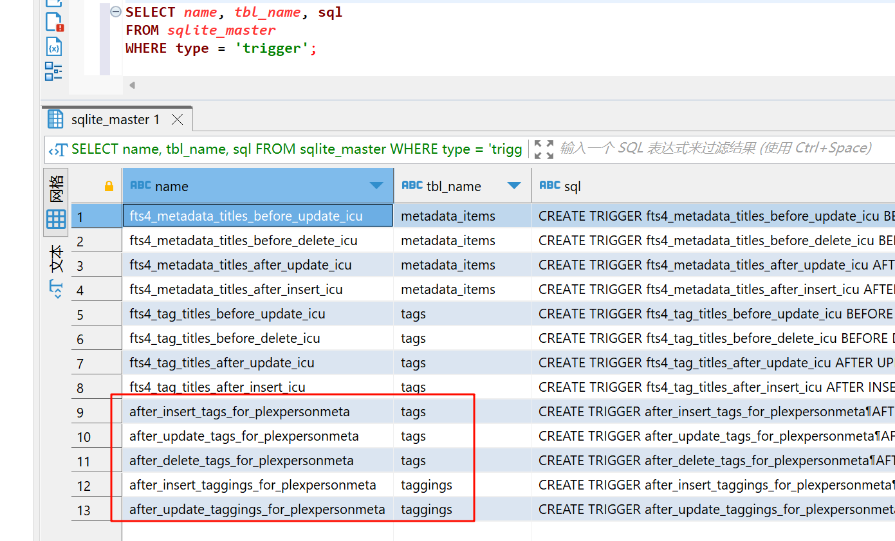
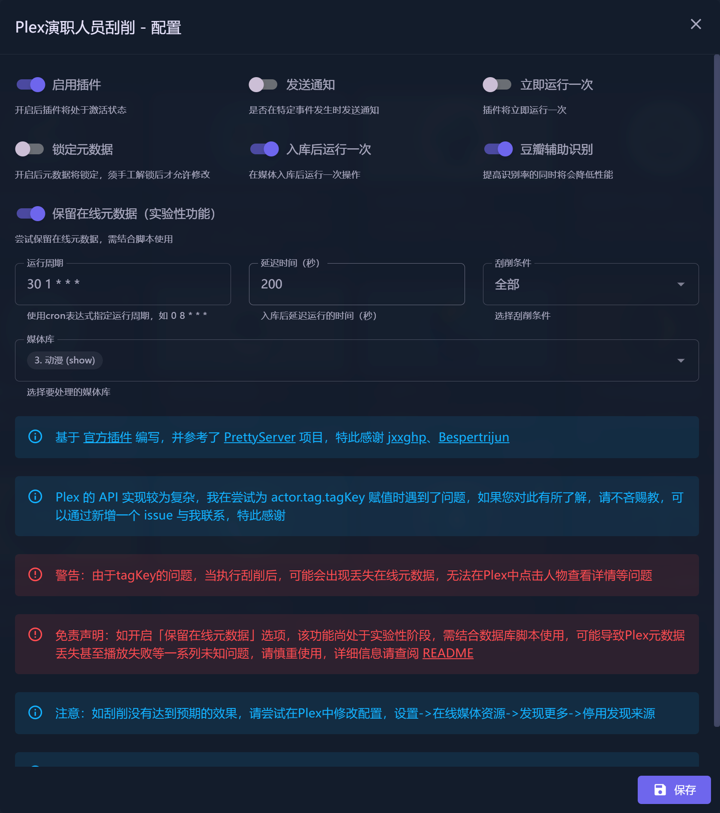

# Plex演职人员刮削

实现刮削演职人员中文名称及角色

- **技术难点**：Plex 的 API 实现较为复杂，特别是在处理关联演职人员的 `tagKey`，我在尝试为 `actor.tag.tagKey` 赋值时遇到了问题。如果您对此有所了解，请不吝赐教，欢迎通过在项目的 GitHub 页面新增一个 issue 与我联系，我将非常感谢您的反馈和帮助。
- **操作警告**：在刮削演职人员信息后，可能会出现一些问题，例如丢失在线元数据，或者在 Plex 中无法通过点击演职人员的名字来查看其详细信息。请在操作前备份相关数据，以防不测。

在进行任何操作前，请确保您已经做好了完整的数据备份，并理解所有相关的技术细节和潜在风险。如果您有更多关于 Plex API 的技术问题或需求，欢迎与我联系或查阅更多资料。

#### 保留在线元数据功能注意事项

- 请注意，该功能目前处于**实验阶段**。在正式启用前，我们**强烈推荐**您在次要使用环境中进行测试，以确保其稳定性。该功能是通过数据库脚本来实现的，可能会引发元数据丢失、播放问题等风险。在使用之前，请确保您已经详细阅读了所有操作步骤，并进行了充分的数据备份，确保了解所有潜在风险并采取了相应的预防措施。

- 如果您之前使用过本插件，由于保留在线元数据的功能是通过数据库脚本实现的，我们建议对媒体库进行全库元数据刷新，以恢复到历史状态。这是为了避免可能出现的部分元数据无法正常生效的问题。

#### 数据库脚本操作指南

1. **停用 Plex 服务**
   - 在开始任何备份或修改之前，请先停用 Plex 服务，以避免数据冲突。
   - 
2. **备份 Plex 数据库**
   - **重要：** 一定要先备份您的 Plex 数据库。您可以找到数据库文件通常在以下路径：`/Plug-in Support/Databases/com.plexapp.plugins.library.db`。
   - 关于如何备份和恢复数据库，请参考这些官方指南：
     - [修复损坏的数据库](https://support.plex.tv/articles/repair-a-corrupted-database/)
     - [恢复备份的数据库](https://support.plex.tv/articles/202485658-restore-a-database-backed-up-via-scheduled-tasks/)

3. **下载并执行 SQL 脚本**：
   - 在备份完成后，请下载附件中的 SQL 脚本。
   - 使用如 [SQLiteStudio](https://github.com/pawelsalawa/sqlitestudio)、[Navicat for SQLite](https://www.navicat.com/en/products/navicat-for-sqlite) 或 [DBeaver](https://dbeaver.com/docs/dbeaver/Database-driver-SQLite/) 等工具打开您的 Plex 数据库。
   - 执行下载的 SQL 脚本，更新数据库。

4. **验证脚本执行结果**：
   - 脚本执行完毕后，运行以下 SQL 查询以确认触发器是否已正确创建：
     ```sql
     SELECT name, tbl_name, sql
     FROM sqlite_master
     WHERE type = 'trigger';
     ```
   - 如果查询结果显示如附件截图中的红框内容，则表示脚本已成功执行。

   

5. **下载 SQL 脚本**：
   - 点击此处[下载脚本](resources/trigger.sql)。

请在操作过程中保持高度警惕，确保每一步均正确执行，以避免数据丢失或损坏。

#### 感谢

- 本插件基于 [官方插件](https://github.com/jxxghp/MoviePilot-Plugins) 编写，并参考了 [PrettyServer](https://github.com/Bespertrijun/PrettyServer) 项目，实现了插件的相关功能。
- 特此感谢 [jxxghp](https://github.com/jxxghp)、[Bespertrijun](https://github.com/Bespertrijun) 等贡献者的卓越代码贡献。
- 如有未能提及的作者，请告知我以便进行补充。




