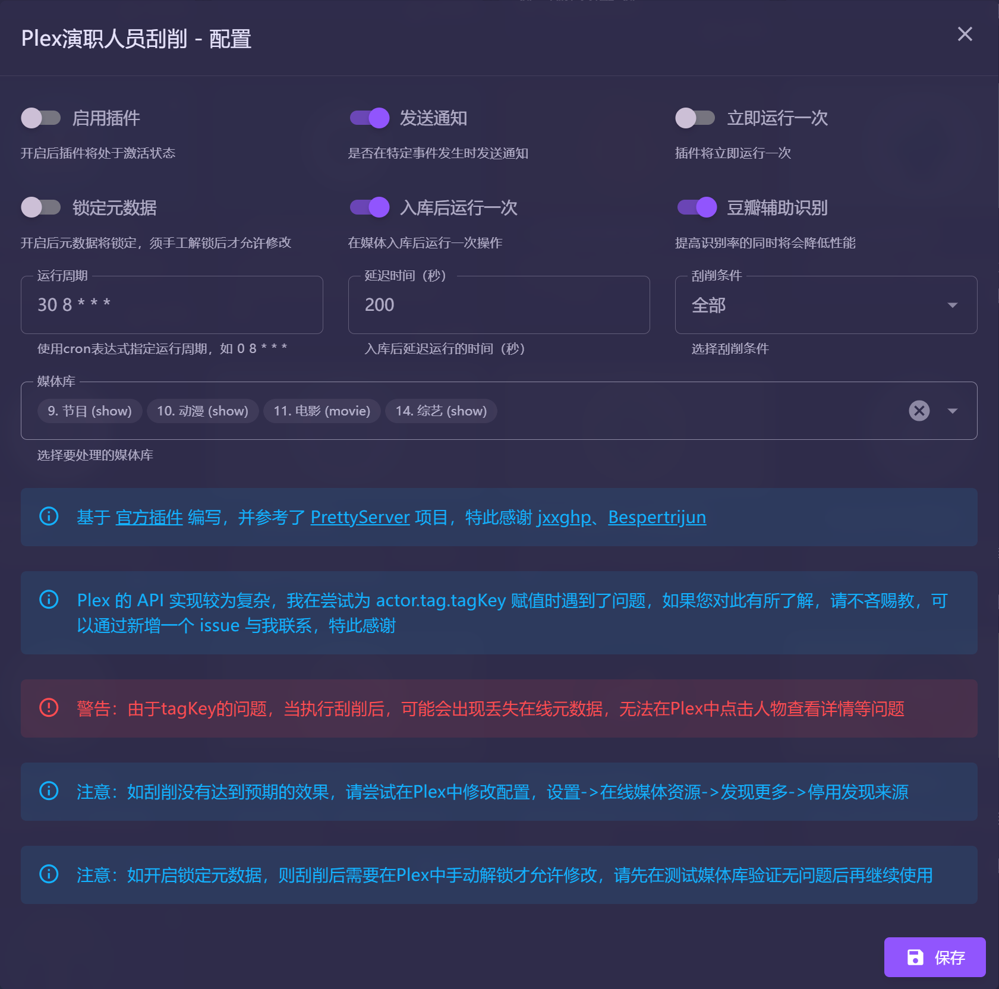

# Plex演职人员刮削

实现刮削演职人员中文名称及角色

- **技术难点**：Plex 的 API 实现较为复杂，特别是在处理关联演职人员的 `tagKey`，我在尝试为 `actor.tag.tagKey` 赋值时遇到了问题。如果您对此有所了解，请不吝赐教，欢迎通过在项目的 GitHub 页面新增一个 issue 与我联系，我将非常感谢您的反馈和帮助。
  
- **操作警告**：在刮削演职人员信息后，可能会出现一些问题，例如丢失在线元数据，或者在 Plex 中无法通过点击演职人员的名字来查看其详细信息。请在操作前备份相关数据，以防不测。

在进行任何操作前，请确保您已经做好了完整的数据备份，并理解所有相关的技术细节和潜在风险。如果您有更多关于 Plex API 的技术问题或需求，欢迎与我联系或查阅更多资料。

#### 保留在线元数据功能注意事项

- **2024.7.7 由于未知原因，部分媒体库演员数据被清理，因此该方案搁置，相关脚本下线，请勿开启该功能，如已使用该功能，建议尽快恢复数据库备份**

#### 感谢

- 本插件基于 [官方插件](https://github.com/jxxghp/MoviePilot-Plugins) 编写，并参考了 [PrettyServer](https://github.com/Bespertrijun/PrettyServer) 项目，实现了插件的相关功能。
- 特此感谢 [jxxghp](https://github.com/jxxghp)、[Bespertrijun](https://github.com/Bespertrijun) 等贡献者的卓越代码贡献。
- 如有未能提及的作者，请告知我以便进行补充。

